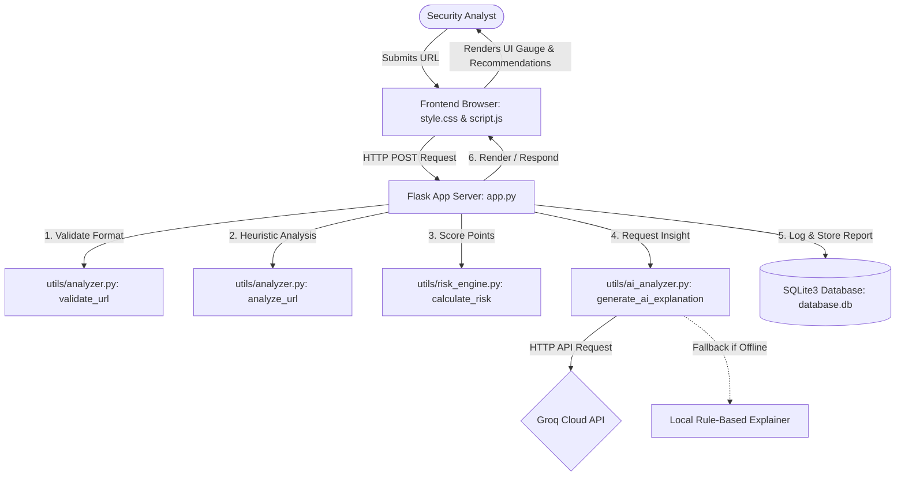

# 🛡️ SentinelURL: Enterprise Phishing & Malicious URL Analysis Platform
## Detailed Technical System Documentation

Welcome to the official, complete technical documentation for **SentinelURL** (located at [cyberpro](file:///C:/Users/farha/Desktop/cyberpro)). This guide serves as an exhaustive reference manual for developers, security engineers, and academic reviewers.

---

## 📖 Executive Summary & Purpose

**SentinelURL** is a lightweight, high-performance, self-contained cybersecurity application engineered to inspect, categorize, and explain phishing and malicious URL threats in real time. By marrying traditional **heuristic analysis (static signature checks)** with **cognitive AI (Llama 3.1 LLM via the Groq API)**, SentinelURL bridges the gap between raw risk scoring and human-readable threat intelligence. 

The application is structured around a robust Flask backend, an embedded SQLite3 database, a weighted heuristics analyzer, and a premium, responsive cyberpunk-themed dashboard that provides visual feedback to security analysts.

---

## 🛠️ Technology Stack

SentinelURL utilizes a modern and highly optimized stack designed for swift request-response cycles, offline resilience, and aesthetic quality.

| Component | Technology / Library | Role & Description |
| :--- | :--- | :--- |
| **Backend Core** | Python 3.8+ / [Flask](https://flask.palletsprojects.com/) | Powers the application server, routing, input validations, database management, and helper classes. |
| **Local Database** | SQLite3 (Embedded `database.db`) | Handles persistence of historical scans, structural metrics, and generated AI threat summaries. |
| **AI Threat Intelligence** | Groq Cloud SDK (`llama-3.1-8b-instant`) | Generates context-specific, professional risk assessments and action items. |
| **Frontend UI/UX** | HTML5, Vanilla CSS3, JavaScript (ES6+) | Implements the responsive, dark-mode cyberpunk user interface, radar widgets, and interactive gauges. |
| **Styling & Fonts** | CSS Variables, Google Fonts (Orbitron/Inter) | Provides theme consistency, high-tech typography, and custom glow animations. |
| **Iconography** | FontAwesome 6.4.0 (CDN) | Renders cybersecurity, navigation, and validation icons. |

---

## 📁 System Directory Structure

The directory structure is organized clean and modularly:

```
cyberpro/
├── app.py                      # Main entrypoint; Flask server setup, endpoints & DB initialization
├── database.db                 # SQLite3 database storing scans (automatically created on run)
├── requirements.txt            # Python dependencies (Flask, groq, python-dotenv)
├── .env                        # Configuration environment file (API keys, ports, secret keys)
├── DOCUMENTATION.md            # Detailed application system manual (this document)
├── README.md                   # Quick-start summary page
├── templates/                  # Flask HTML view templates
│   ├── index.html              # Main dashboard with URL input, radar loader, and features card
│   ├── result.html             # Detailed threat report card with count-up gauge & recommendations
│   └── history.html            # Scan intelligence table directory with client search filtering
├── static/                     # Frontend client assets
│   ├── style.css               # Premium CSS styling, animations, responsive grids, and variables
│   └── script.js               # Visual gauges count-up, loading state text rotations, search filter
└── utils/                      # Backend utility package
    ├── __init__.py             # Package initializer
    ├── analyzer.py             # Heuristics rules, domain validation, and regex checks
    ├── risk_engine.py          # Points accumulator and risk classification engine
    └── ai_analyzer.py          # Client connection to Groq SDK and local fallback engine
```

---

## ⚙️ Core Architecture & Data Flow

The application processes requests synchronously or via AJAX JSON requests. Below is a representation of the architecture components, followed by a sequence diagram tracing a single scan lifecycle.

### High-Level Architecture Diagram


### Complete Sequence Lifecycle Flow
The life cycle of a single URL analysis progresses through the following steps:

```mermaid
sequenceDiagram
    autonumber
    actor Analyst as Security Analyst (Client)
    participant Fe as Frontend UI (index.html / script.js)
    participant Be as Flask Backend (app.py)
    participant An as Heuristic Analyzer (analyzer.py)
    participant Re as Risk Engine (risk_engine.py)
    participant AI as AI Coordinator (ai_analyzer.py)
    participant Db as SQLite Database (database.db)
    participant Groq as Groq AI Cloud

    Analyst->>Fe: Type URL and click "Analyze Link"
    Note over Fe: Client-side validation checks syntax
    Fe->>Fe: Hide submit button, show animated radar spinner, & rotate status texts
    Fe->>Be: HTTP POST to /analyze (URL payload)
    Be->>Be: Server-side validation via validate_url()
    
    rect rgb(20, 24, 33)
        Note over Be, An: 1. Heuristic Check
        Be->>An: Run analyze_url()
        An->>An: Verify SSL scheme, IP hostname, keywords, TLD, length, special characters
        An-->>Be: Return dictionary of indicators & list of issues
    end

    rect rgb(33, 20, 20)
        Note over Be, Re: 2. Risk Classification
        Be->>Re: Run calculate_risk()
        Re->>Re: Sum points for each flagged heuristic (max 100)
        Re-->>Be: Return risk_score (int) & risk_level (LOW, MEDIUM, HIGH)
    end

    rect rgb(20, 33, 20)
        Note over Be, AI: 3. Threat Assessment
        Be->>AI: Run generate_ai_explanation()
        alt GROQ_API_KEY is configured
            AI->>Groq: Request text completion (llama-3.1-8b-instant)
            Groq-->>AI: Return expert assessment paragraphs
        else GROQ_API_KEY is missing or connection fails
            AI->>AI: Trigger get_fallback_explanation() local generator
        end
        AI-->>Be: Return final AI explanation string
    end

    rect rgb(25, 25, 25)
        Note over Be, Db: 4. Data Persistence
        Be->>Db: Store entry (URL, score, risk level, issues JSON, AI analysis)
        Db-->>Be: Return database ID (scan_id)
    end

    Be->>Fe: Send response (render result.html with result data)
    Fe->>Fe: Initialize gauge, count-up animation, and paint risk gradient
    Fe-->>Analyst: Show complete interactive interactive threat report card
```



---

## 🔍 Deep-Dive Code Analysis

### 1. Flask App Core: [app.py](file:///C:/Users/farha/Desktop/cyberpro/app.py)
The system's backbone. It manages routing, template generation, JSON API responses, and database transactions.

- **Key Functions**:
  - `[get_db_connection()](file:///C:/Users/farha/Desktop/cyberpro/app.py#L25)`: Connects to `database.db`, configuring the database connection's `row_factory` to `sqlite3.Row` for key-value dictionary column lookups.
  - `[init_db()](file:///C:/Users/farha/Desktop/cyberpro/app.py#L34)`: Automatically creates the `scan_history` database table at startup if it does not already exist.
  - **Routes**:
    - `[index()](file:///C:/Users/farha/Desktop/cyberpro/app.py#L61)` (`/`): Returns the dashboard view ([index.html](file:///C:/Users/farha/Desktop/cyberpro/templates/index.html)).
    - `[analyze()](file:///C:/Users/farha/Desktop/cyberpro/app.py#L68)` (`/analyze`, `POST`): Processes URL inputs. Validates correctness, initiates static checks, calculates score, triggers AI API, commits metrics to SQLite, generates safe actions matching risk severity, and outputs a formatted HTML page or JSON responses.
    - `[history()](file:///C:/Users/farha/Desktop/cyberpro/app.py#L183)` (`/history`): Retrieves previous scans to render [history.html](file:///C:/Users/farha/Desktop/cyberpro/templates/history.html).
    - `[report()](file:///C:/Users/farha/Desktop/cyberpro/app.py#L213)` (`/report/<scan_id>`): Resolves and displays specific past scan reports.
    - `[api_history()](file:///C:/Users/farha/Desktop/cyberpro/app.py#L273)` (`/api/history`): Lightweight JSON API endpoint for external integrations or automated clients.

### 2. Static Analyzer: [utils/analyzer.py](file:///C:/Users/farha/Desktop/cyberpro/utils/analyzer.py)
This module evaluates URLs against static safety conditions and checks for common phishing patterns.

- **Heuristic Indicators**:
  1. **HTTPS Verification**: Inspects if the URL scheme matches `https`. If missing, it adds `HTTPS Missing` to the issues.
  2. **IP Hostname Check**: Verifies if the host is a raw IP address (using standard socket utilities `socket.inet_aton` for IPv4 and `socket.inet_pton` for IPv6) rather than a registered domain.
  3. **Keyword Matching**: Scans the URL against blacklisted keywords: `login`, `verify`, `secure`, `account`, `banking`, `wallet`, `signin`, `otp`, `update`.
  4. **TLD Domain Check**: Checks if the domain ends with high-risk TLDs: `.xyz`, `.tk`, `.ml`, `.top`, `.gq`.
  5. **Length Analysis**: Flags URLs exceeding 50 characters, a common tactic for subdomain/domain spoofing.
  6. **Special Character Obfuscation**: Scans for:
     - `@` characters (used to disguise the authentic target domain).
     - Multiple subdomains (more than 4 dots in the URL).
     - URL percent-encoding (`%`).
     - Excessive hyphens (3 or more, common in typo-squatting, e.g. `paypal-login-update-safety.xyz`).

### 3. Risk Engine: [utils/risk_engine.py](file:///C:/Users/farha/Desktop/cyberpro/utils/risk_engine.py)
Computes the vulnerability severity score. It sums points corresponding to flagged conditions, caps the score at `100`, and assigns a severity classification.

- **Score Allocation Model**:
  ```python
  score = 0
  if https_missing:      score += 20
  if ip_address_used:    score += 25
  if keywords_found:     score += 15
  if suspicious_tld:     score += 20
  if long_url:           score += 10
  if suspicious_chars:   score += 10
  ```
- **Severity Boundaries**:
  - **LOW**: $0 \le \text{Score} \le 30$
  - **MEDIUM**: $31 \le \text{Score} \le 60$
  - **HIGH**: $61 \le \text{Score} \le 100$

### 4. AI Coprocessor: [utils/ai_analyzer.py](file:///C:/Users/farha/Desktop/cyberpro/utils/ai_analyzer.py)
Binds the heuristic results to the Groq Cloud SDK API, leveraging the high-speed Llama 3.1 model.

- **Groq Integration**:
  - Model: `llama-3.1-8b-instant`
  - Temperature: `0.2` (for factual, repeatable threat explanations)
  - Max Tokens: `500`
  - **System Prompt**: Instructs the model to act as a cybersecurity analyst, providing professional threat descriptions, impact summaries, and security recommendations.
- **Fail-Safe Mechanism**:
  If the API call fails or if the API key is not configured, `[get_fallback_explanation()](file:///C:/Users/farha/Desktop/cyberpro/utils/ai_analyzer.py#L69)` automatically runs. It generates detailed local descriptions based on the computed risk metrics.

### 5. Frontend & CSS System: [style.css](file:///C:/Users/farha/Desktop/cyberpro/static/style.css) & [script.js](file:///C:/Users/farha/Desktop/cyberpro/static/script.js)
Handles the visual layout and animations.
- **CSS Architecture**: Builds on custom properties (CSS variables) mapping colors for low, medium, and high risk levels. It features a responsive layout, a loading spinner, and styled result card grids.
- **JS Features**:
  - Intercepts form submissions to check the URL scheme, display a loading radar widget, and rotate progress messages during scanning.
  - Uses `requestAnimationFrame` on the results page to animate the circular threat gauge up to its target score.
  - Implements a real-time table search/filter in the scan history view.

---

## 🗄️ Database Architecture & Schema

The system stores scan results in a local SQLite file (`database.db`). Database tables and fields are designed for safety and efficiency.

```sql
CREATE TABLE IF NOT EXISTS scan_history (
    id INTEGER PRIMARY KEY AUTOINCREMENT,
    url TEXT NOT NULL,
    risk_score INTEGER NOT NULL,
    risk_level TEXT NOT NULL,
    detected_issues TEXT NOT NULL, -- Serialized JSON list of issues
    ai_analysis TEXT NOT NULL,     -- The generated AI threat intelligence description
    scan_time TIMESTAMP DEFAULT CURRENT_TIMESTAMP
);
```

> [!NOTE]
> Database transactions in SentinelURL use parameterized SQL statements to safeguard against SQL Injection vulnerabilities. For example:
> `cursor.execute("SELECT * FROM scan_history WHERE id = ?", (scan_id,))`

---

## 🔧 Installation & Deployment Guide

Follow these steps to run SentinelURL on your local machine:

### 1. Prerequisites
- Python 3.8 or higher.
- An active internet connection (to connect to Groq Cloud and fetch stylesheet assets).

### 2. Download and Extract
Ensure all application files are placed inside a folder, for example `C:\Users\farha\Desktop\cyberpro`.

### 3. Install Dependencies
Open PowerShell or your command terminal, navigate to the folder, and run:
```powershell
cd "C:\Users\farha\Desktop\cyberpro"
pip install -r requirements.txt
```
*Dependencies installed include: `Flask`, `groq`, and `python-dotenv`.*

### 4. Configure the Environment
Create or edit the `[.env](file:///C:/Users/farha/Desktop/cyberpro/.env)` file in the root directory:
```env
# Groq Cloud API Authentication
GROQ_API_KEY=your_groq_api_key_here

# Host and Port Configuration
HOST=127.0.0.1
PORT=5000

# Secret Key for Flash Sessions
SECRET_KEY=cybersecurity_phishing_detector_key_2026
```

### 5. Start the Server
Run the application using Python:
```powershell
python app.py
```
Expected output:
```text
INFO:__main__:Database initialized successfully.
 * Serving Flask app 'app'
 * Debug mode: on
 * Running on http://127.0.0.1:5000
```

### 6. Verify URL Resolution
Open your browser and navigate to `http://127.0.0.1:5000`. You can test the detection features using these URLs:
- Safe URL: `https://www.google.com` (Low Risk)
- Risky URL: `http://signin-paypal-verify.xyz` (High Risk)

---

## 🔒 Security Audit & Recommendations

An analysis of SentinelURL's security architecture highlights several features and potential areas for reinforcement:

### Implemented Controls
1. **No SQL Injection**: Database inserts and lookups use parameterized queries, preventing SQL command injection.
2. **Resilience**: The system catches connection errors and API exceptions to maintain availability, falling back to local analysis when needed.
3. **Inputs Checked**: Inputs are validated on both the client side and the server side to ensure URLs are properly formatted.

### Recommendations for Production Environments
- **Input Sanitization**: Use a validation library to clean URL paths and parameters before processing to prevent cross-site scripting (XSS) in views.
- **API Key Management**: Store API credentials in a secure system environment variable or secret vaults rather than in `.env` text files.
- **Access Limits**: Implement route rate-limiting (e.g., using Flask-Limiter) to protect endpoints from automated scanning or abuse.
- **Connection Security**: Enforce HTTPS for the application itself when hosting in production environments.

---

## 🚀 Academic & Production Roadmap

This system can be expanded with several advanced features:
- **Whois Domain Details**: Fetch domain registration age and owner info to detect newly registered suspicious domains.
- **Dynamic Sandbox Scanner**: Load URLs inside a virtual environment to monitor for malicious downloads or unauthorized redirects.
- **Safe Browsing API Integration**: Check domains against Google Safe Browsing and PhishTank lists.
- **Browser Extension**: Build a browser addon that automatically sends the current tab's URL to SentinelURL's API for real-time validation.
